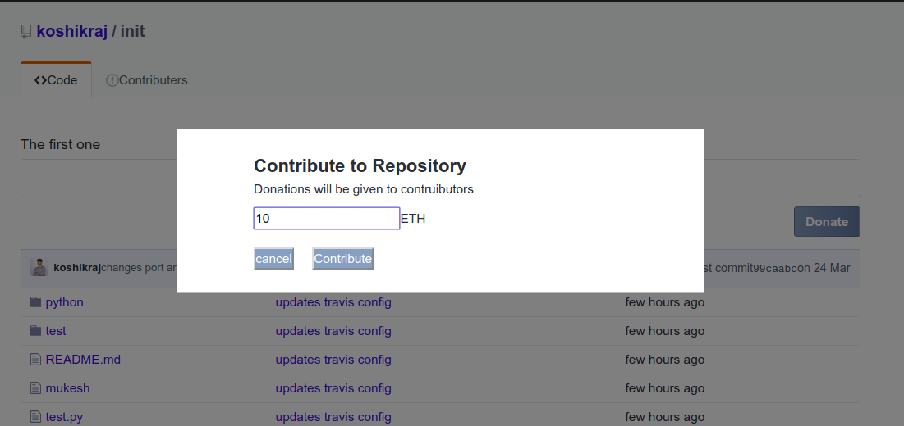
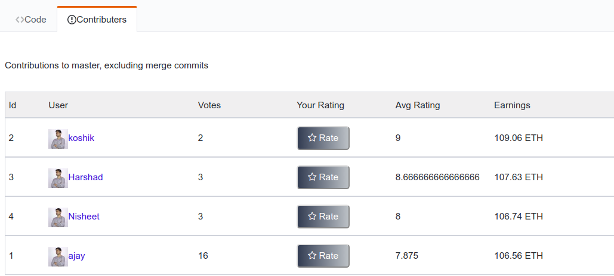
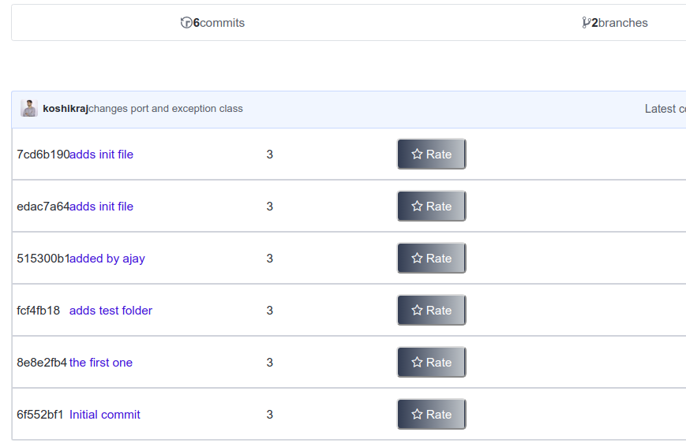

# dorahacks_hackathon
Bounty messaging feature for crowd funding application

Won 2nd place :trophy: in the DoraHacks hackathon, India edition in 2018.

## Quick start

There are 2 dependencies in the dApp setup.
* A GitLab server
* A PostgreSQL

### GitLab server setup

* Setup the GitLab server that offers API.
  
    * Install the GitLab community edition -- https://about.gitlab.com/install/
    
    * Alternatively you can setup up the server using the docker image -- https://hub.docker.com/r/gitlab/gitlab-ce/
    
* Configure the server.
    
    * Once the server is up, create a new user or use the default root user to login.
    
    * Create a private token for the user from the settings panel.
    
    * Replace the server details and private token in `./api/gitlab_lib/middleware.py`with the created server and private token.
    
    * Create some sample repos in the server.
    
### PostgreSQL setup

* [Install and configure](https://www.digitalocean.com/community/tutorials/how-to-install-and-use-postgresql-on-ubuntu-16-04) a latest version of PostresSQL database.

* Create a user and a database. Update the username, password and database in `.api/config.py`.

* Migrate the database schema to the created Postgres DB. 

### deploy smart contract

* Pre requisite

    * Run a local Ethereum client with RPC port 8545 connected to private or test network

*   Perform truffle migrate to deploy the contract

    * Navigate to folder `./crowd-fund-fe`

    * `truffle migrate`

    *   Copy the generate ABI file `./migrations/Voting.json` to `./src/contracts`
    
* Run the React application    
    * Go to root folder

    * `npm install`

    * `npm start`

* Deploy and run the middleware backend application 
    
    * Open new window

    * `cd api`

    * `pip install -r requirement.txt`

    * `python app.py`
    
Update the server information in the react app to point to the python server.
    
    
### Screenshots of React app

 
